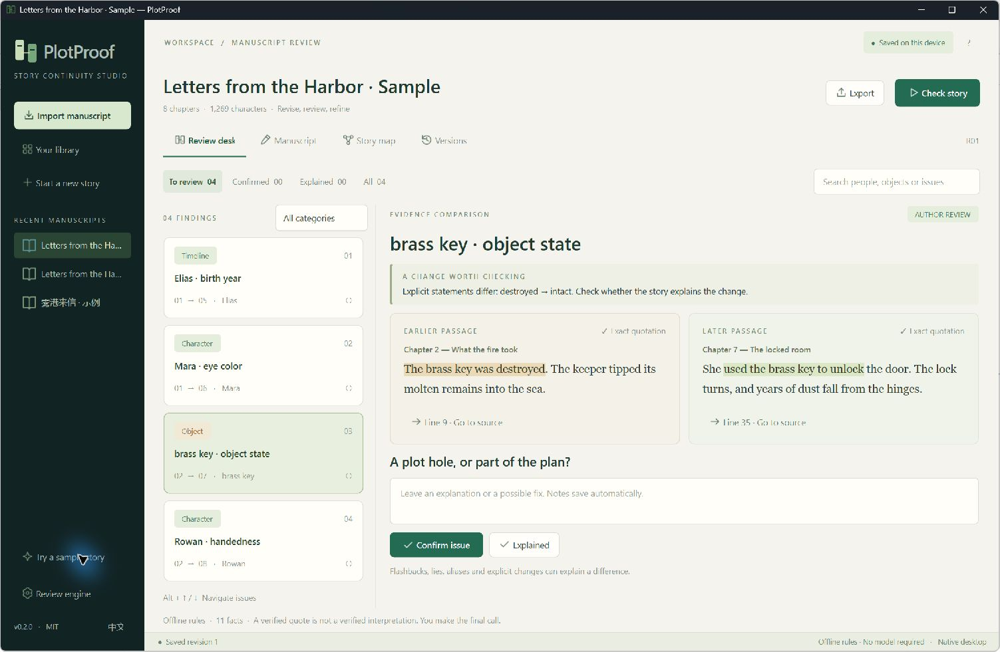
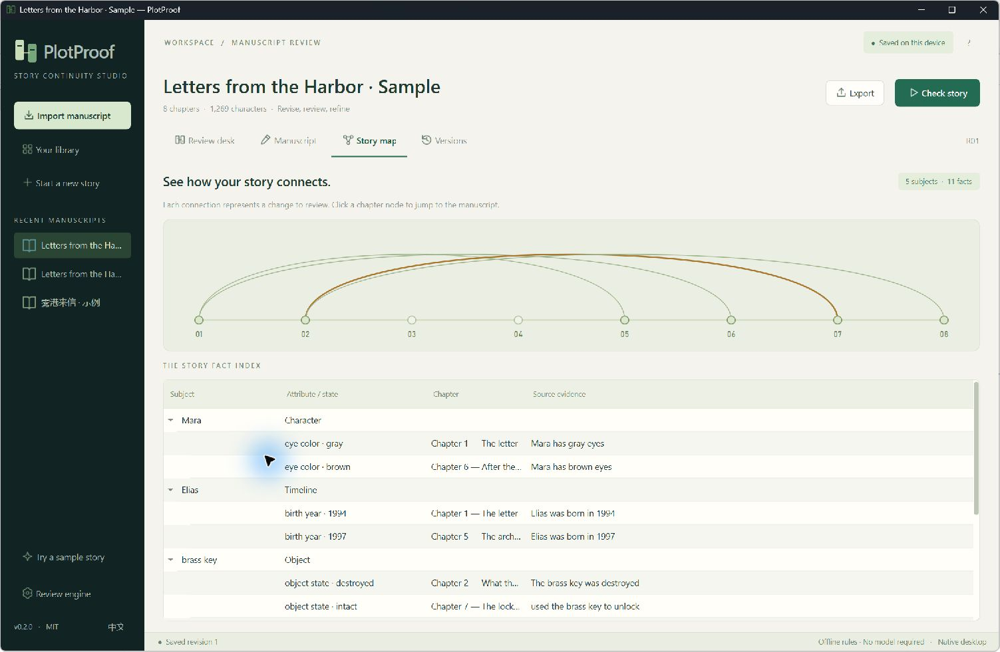

<h1>PlotProof</h1>
<h3>이야기의 모순을 찾고, 원문으로 확인하세요.</h3>

이야기의 설정과 전개를 검토하는 무료 오픈 소스 데스크톱 앱입니다. 서로 다른 두 구절을 비교하고, 원문으로 이동하고, 검토한 내용을 다음 원고에도 이어갈 수 있습니다.

Windows x64 · Native desktop · Local first · MIT

<a href="README.md">English</a> · <a href="README.zh-CN.md">简体中文</a> · <a href="README.ja.md">日本語</a> · <a href="README.ko.md">한국어</a> · <a href="README.es.md">Español</a>

<a href="https://github.com/CARL-JOSEPH-LEE/PlotProof/raw/refs/heads/main/installers/PlotProof-0.2.0-windows-x64.zip"><strong>Windows 버전 다운로드 · v0.2.0</strong></a> · <a href="#quick-start">빠른 시작</a> · <a href="#source">소스에서 실행</a>

PlotProof 0.2.0 · 실제 Windows 앱 · 기본 제공 가상 예제 원고

<h2>2장에서 녹여 없앤 열쇠가, 어떻게 7장에서 문을 열까요?</h2>

이야기의 모순은 멀리 떨어진 구절 사이에 숨어 있습니다. PlotProof는 바뀌기 전후의 원문을 한 화면에 보여주고, 무엇이 달라졌는지와 근거가 어느 장에 있는지 알려줍니다. 모순인지 의도한 전개인지는 작가가 판단합니다.

<h2>의문을 발견하는 순간부터 다음 원고까지</h2>
<table>
<tr><td><strong>출처를 따라가는 검토</strong></td><td>두 인용문을 문맥과 함께 강조하고 장과 줄 위치를 표시합니다. 클릭하면 원고 편집기의 해당 구절로 이동합니다.</td></tr>
<tr><td><strong>이야기의 연결을 한눈에</strong></td><td>서로 다른 장에 걸친 변화를 지도로 보고, 인물과 사물별 사실 목록에서 원문 근거를 확인합니다.</td></tr>
<tr><td><strong>수정 후에도 이어지는 판단</strong></td><td>문제로 확정하거나 설명을 남길 수 있습니다. 무관한 수정에서는 판단을 유지하고, 근거 구간이 바뀌면 다시 검토하도록 표시합니다.</td></tr>
<tr><td><strong>집필과 검토를 위한 작업 공간</strong></td><td>TXT, Markdown, DOCX 가져오기, 자동 저장, 버전 저장과 복원, PDF·HTML·JSON 내보내기를 지원합니다.</td></tr>
</table>

장 사이의 연결과 사실 목록은 실제 원고 검토 결과로 생성됩니다.

<h2 id="quick-start">빠른 시작</h2>
<ol>
<li>Windows ZIP을 다운로드하고 폴더 전체를 압축 해제합니다.</li>
<li>PlotProof.exe를 더블 클릭합니다. 옆의 _internal 폴더를 그대로 두세요. 실행 환경이 포함되어 있으며 독립된 네이티브 창이 열립니다.</li>
<li>“Try a sample story”를 선택하고 사라진 열쇠의 원문을 확인한 뒤, 수정과 재검사를 시도해 보세요. 예제는 모델 설정 없이 오프라인으로 실행됩니다.</li>
</ol>

데스크톱 UI는 영어와 중국어를 지원하며, 두 언어의 예제 원고가 포함되어 있습니다.

<h2>오프라인으로 시작하고, 원하는 모델을 연결하세요</h2>
<table>
<tr><td><strong>오프라인 규칙</strong></td><td>바로 사용할 수 있습니다. 명시된 인물 속성과 사물·생사 상태 중 일부를 검사합니다. 작업 흐름을 체험하거나 단순하고 분명한 변화를 찾는 데 적합합니다.</td></tr>
<tr><td><strong>Ollama</strong></td><td>설치된 로컬 모델로 의미 기반 사실 추출과 후보 검토를 수행합니다. “Review engine”에서 주소와 모델을 설정하세요.</td></tr>
<tr><td><strong>호환 API</strong></td><td>원하는 Chat Completions 서비스에 연결합니다. 모델 검토를 실행할 때 관련 원고가 해당 서비스로 전송됩니다.</td></tr>
</table>

프로젝트, 초안, 버전은 기기에 저장됩니다. 계정이나 사용 정보 수집 기능이 없습니다. 서비스 인증 정보는 실행 중 메모리에만 보관하며, 모델 가중치는 포함하지 않습니다.

<h2>원문 근거를 확인하는 과정</h2>

장 분석 → 명시적 사실 추출 → 인용문 검증 → 값 비교 → 문맥 재검토 → 작가 판단

인용문을 근거로 채택하려면 해당 원문 단락에 정확히 일치하는 구절이 단 한 번 존재해야 합니다. 사실을 대상과 속성별로 묶고 서로 다른 값을 후보로 만듭니다. 모델 모드에서는 주변 문맥을 검토해 변화에 설명이 있는지 확인합니다.

<a href="docs/TECHNICAL_OVERVIEW.md">기술 개요 읽기</a>

현재 지원 범위

원고당 최대 30만 문자입니다. 오프라인 규칙의 범위는 제한적이며, 모델은 별칭, 암묵적 시간 관계, 제공된 문맥 밖의 설명을 놓칠 수 있습니다. 인용문 검증은 출처를 확인할 뿐 해석의 정확성을 보장하지 않습니다. 최종 판단은 작가의 몫입니다.

<h2 id="source">소스에서 실행</h2>

Python 3.10+ · PySide6 / Qt Widgets · Windows x64 포터블 버전. Windows에서 소스로 실행하려면:

<pre><code>git clone https://github.com/CARL-JOSEPH-LEE/PlotProof.git
cd PlotProof
python -m venv .venv
.venv\Scripts\python -m pip install -e .
.venv\Scripts\python -m plotproof</code></pre>

<a href="docs/DEVELOPMENT.md">개발·테스트·패키징 안내</a>

<h2>다음 원고를 함께 더 좋게 만들어요</h2>

놓친 모순이나 잘못 표시된 자연스러운 변화가 있다면 짧은 예제와 기대 결과를 보내주세요. 별칭 처리, 시간 관계, 모델 평가, 접근성 개선을 환영합니다.

<a href="CONTRIBUTING.md">Contributing</a> · <a href="https://github.com/CARL-JOSEPH-LEE/PlotProof/issues">Issues</a> · <a href="docs/VALIDATION.txt">Validation</a>

앱 소스 코드는 MIT 라이선스입니다. 포함된 구성 요소에는 각각의 라이선스가 적용됩니다. <a href="LICENSE">MIT</a> · <a href="THIRD_PARTY_NOTICES.txt">Third-party notices</a>

